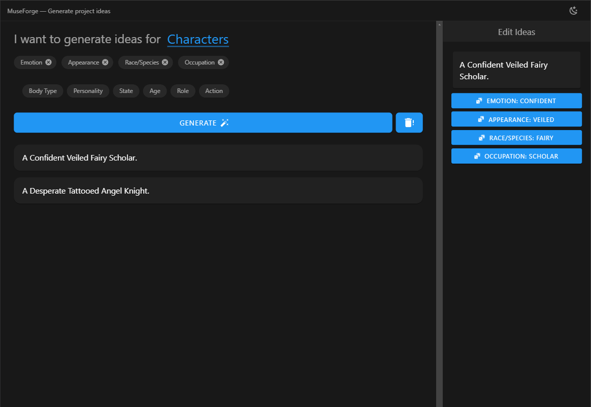

# 🎨✨ Inspiration Generator for Artists

[](https://vuejs.org/)
[](https://vuetifyjs.com/)
[](https://www.gnu.org/licenses/gpl-3.0)

A dynamic web application that helps artists generate creative inspiration cards through customizable keyword combinations. Perfect for overcoming creative block! 🖌️💡



## 🌟 Features

- 🎭 **Category Selection** (Characters/Environments/Props)
- 🃏 **Smart Sentence Generation** with grammatical formatting
- 🖼️ **Card Management** (~~Save(WiP)~~/Like/Edit/Delete)
- 🌓 **Dark/Light Mode** with system preference detection
- 🎲 **Tag Rerolling** for endless combinations
- 💾 **Local Storage** for persistent ideas
- 🎨 **Vuetify-powered** sleek UI

## 🛠️ Local Installation

```bash
# Clone repository
git clone https://github.com/yourusername/inspiration-generator.git
```
```bash
# Install dependencies
npm install
```
```bash
# Start development server
npm run dev
```

## 🚀 Usage

1. Select a category (Characters/Environments/Props)
2. Choose tags from dynamically loaded options
3. Generate unique inspiration cards
4. Edit/Reroll individual tags in cards
5. Save favorites ❤️ and manage your collection
6. Toggle theme between dark/light modes

## 🧩 Tech Stack

* Frontend: Vue.js 3 (Composition API)
* State Management: Pinia 🍍
* UI Framework: Vuetify 3
* Build Tool: Vite ⚡
* Icons: Material Design Icons
* Persistence: localStorage

## 📄 License
This project is licensed under the GNU General Public License v3.0. See [LICENSE](LICENSE) file for details.

**Key requirements:**
- 🛡️ Any derivative work must be open source
- 📜 License and copyright notice must be preserved
- 🔗 Changes must be documented
- 🚫 No additional restrictions can be added

**Full license text:** [https://www.gnu.org/licenses/gpl-3.0.en.html](https://www.gnu.org/licenses/gpl-3.0.en.html)